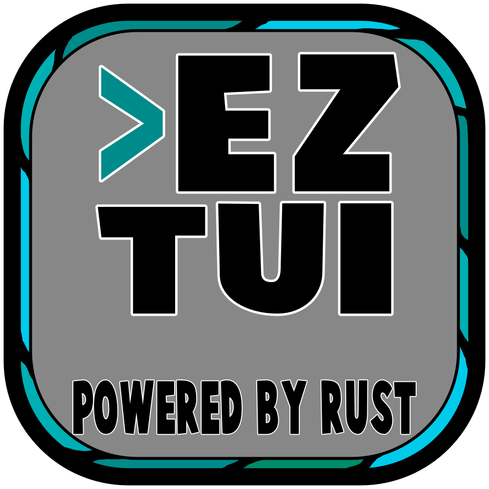

<h1 align="center">
   
  
   
  EZTUI
   
   
</h1>

<h1 align="center">
    
    
    
    
    
</h1>

# What is eztui

Eztui is a crate for making TUI's [Text User Interface](https://en.wikipedia.org/wiki/Text-based_user_interface) in the terimal.
The Back end is using [crossterm](https://docs.rs/crossterm/0.18.2/crossterm/) so that should make eztui cross platform compatible.
I have tried to make this crate as simple to use and make a TUI's in Rust.
For more details, please check out the [Road Map](#roadmap) for Eztui.

# Roadmap

In the section I will update as I develop eztui.
    * <b>Add Key Input Support<\b> will be one of the next things I work on for This crate.
    * <b>Windows Holding Windows<\b> will probably be a thing by 0.0.3
